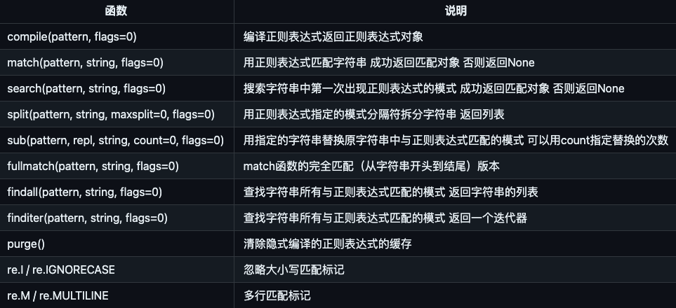

# py_100days
[原项目地址](https://github.com/jackfrued/Python-100-Days)

## day10 pygame
简单的小游戏开发， 面向对象

[pygame](https://www.pygame.org/news) 

3d游戏可以使用 Panda3D

## day11 文件读写
### 操作模式
* 'r'	读取 （默认）
* 'w'	写入（会先截断之前的内容）
* 'x'	写入，如果文件已经存在会产生异常
* 'a'	追加，将内容写入到已有文件的末尾
* 'b'	二进制模式
* 't'	文本模式（默认）
* '+'	更新（既可以读又可以写）

### json
* dump: 对象 -> json -> file  将对象保存到json文件
* dumps: 对象 -> json  将对象保存为json字符串
* load: 文件 -> json -> 对象  从文件中加载json对象
* loads: json -> 对象  从字符串加载出对象

## day12 正则

python通过re模块提供正则的支持，核心函数如下：

## day13 进程和线程
* 进程
  * multiprocessing包
    * process
      * target， args
      * start
      * join
    * queue
* 线程
  * threading包
    * thread
      * target， args
      * start
      * join

***协程***
> 现代操作系统对I/O操作的改进中最为重要的就是支持异步I/O。如果充分利用操作系统提供的异步I/O支持，就可以用单进程单线程模型来执行多任务，这种全新的模型称为事件驱动模型。Nginx就是支持异步I/O的Web服务器，它在单核CPU上采用单进程模型就可以高效地支持多任务。在多核CPU上，可以运行多个进程（数量与CPU核心数相同），充分利用多核CPU。用Node.js开发的服务器端程序也使用了这种工作模式，这也是当下并发编程的一种流行方案。

> 在Python语言中，单线程+异步I/O的编程模型称为协程，有了协程的支持，就可以基于事件驱动编写高效的多任务程序。协程最大的优势就是极高的执行效率，因为子程序切换不是线程切换，而是由程序自身控制，因此，没有线程切换的开销。协程的第二个优势就是不需要多线程的锁机制，因为只有一个线程，也不存在同时写变量冲突，在协程中控制共享资源不用加锁，只需要判断状态就好了，所以执行效率比多线程高很多。如果想要充分利用CPU的多核特性，最简单的方法是多进程+协程，既充分利用多核，又充分发挥协程的高效率，可获得极高的性能。关于这方面的内容，在后续的课程中会进行讲解。

***python的多线程无法利用多核优势***
> 比较遗憾的一件事情是Python的多线程并不能发挥CPU的多核特性，这一点只要启动几个执行死循环的线程就可以得到证实了。之所以如此，是因为Python的解释器有一个“全局解释器锁”（GIL）的东西，任何线程执行前必须先获得GIL锁，然后每执行100条字节码，解释器就自动释放GIL锁，让别的线程有机会执行，这是一个历史遗留问题，但是即便如此，就如我们之前举的例子，使用多线程在提升执行效率和改善用户体验方面仍然是有积极意义的。